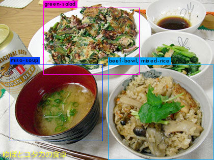

# Unity_Detection2AR
<strong>A simple solution to incorporate object localization into conventional computer vision object detection algorithms. </strong>

<strong>IDEA: </strong> There aren't that many open source real-time 3D object detection. This is an example of using "more popular" 2D object detection and then localize it with a few feature points. It uses recently released [Barracuda](https://docs.unity3d.com/Packages/com.unity.barracuda@1.0/manual/index.html) for object detection and ARFoundation for AR. It works both on iOS and Android devices.

Currently supports tiny Yolo2 and 3.

## Requirements
    "com.unity.barracuda": "1.0.3",
    "com.unity.xr.arfoundation": "4.0.8",
    "com.unity.xr.arkit": "4.0.8",
    "com.unity.xr.arcore": "4.0.8"

## Usage
It is developed in Unity 2020.2.1 and requires product ready Barracuda with updated AR packages. The preview Barracuda versions seems unstable and may not work.
* Open the project in Unity (Versions > 2019.4.9).
* In `Edit -> Player Settings -> Other XR Plug-in Management`, make sure Initialize XR on Startup and Plug-in providers are marked to enable ARCamera.\
* From Inspector `Scene: Detect -> Game Object: Camera Image -> Script: Phone AR Camera`, choose Selected_detector to either Yolo2_tiny or Yolo3_tiny(default).
* Make sure that Detector has ONNX Model file and Labels file set.
* For Android, check the Minimum API Level at `Project Settings -> Player -> Others Settings -> Minimum API Level`. it requires at least Android 7.0 'Nougat' (API Level 24).
* For Android, also enable Auto Graphics API. [See Issue](https://github.com/derenlei/Unity_Detection2AR/issues/3#issuecomment-727286451)
* In `File -> Build settings` choose Detect and hit Build and run.
* For IOS, fix team setting in `Signing & Capabilities`.

## Detection Model
We currently support <strong>Yolo version 2 (tiny)</strong> and <strong>Yolo version 3 (tiny)</strong>. Example models are in `Assets/Models/`.

[yolov3-tiny-416.onnx](Assets/Models/yolov3-tiny-416.onnx) is trained on COCO dataset.

[yolov2-tiny-food-freeze.onnx](Assets/Models/yolov2-tiny-food-freeze.onnx) is trained on [FOOD100 dataset](http://foodcam.mobi/dataset100.html) through darknet. A good example of the training tool is [here](https://github.com/bennycheung/Food100_YOLO_Tools). Ideally, it can detect 100 categories of dishes.

## Use Your Own Model
1. Convert your model into the ONNX format. If it is trained through Darknet, convert it into <strong>frozen</strong> tensorflow model first, then ONNX.
2. Upload the model and label to `Assets/Models`. Use inspector to update your model settings in `Scene: Detect -> Game Object: Detector Yolo2-tiny / Detector Yolo3-tiny`. Update anchor info in the DetectorYolo script [here](Assets/Scripts/DetectorYolo2.cs#L46) or [here](Assets/Scripts/DetectorYolo3.cs#L52).
## Acknowledgement
Partial code borrowed from [TFClassify-Unity-Barracuda](https://github.com/Syn-McJ/TFClassify-Unity-Barracuda) and [arfoundation-samples](https://github.com/Unity-Technologies/arfoundation-samples).
